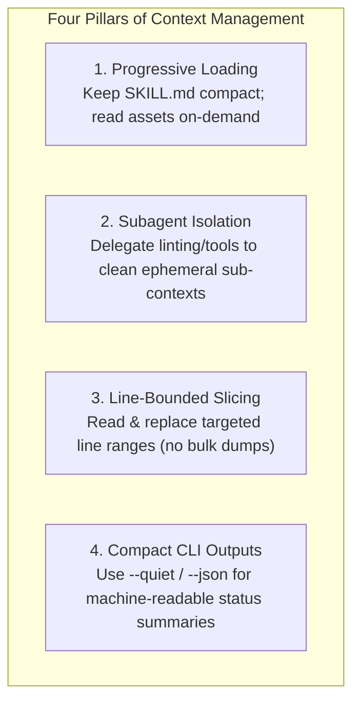

# Agent Skills Catalog (`skills-catalog`)

[](file:///Users/skakumanu/practice/skills-catalog/registry.json)
[](#-runtime-compatibility-matrix)
[](#-model-selection--cost-optimization-framework)
[](#-context-window-management--token-efficiency-standard)
[](file:///Users/skakumanu/practice/skills-catalog/LICENSE)
[](#-testing--quality-assurance)

A curated, production-grade monorepo of modular **Agent Skills** engineered for cross-runtime execution across **Google Antigravity 2.x**, **Claude Code**, and **OpenAI Codex**, complying with the open **Agent Skills Standard**.

---

## 📑 Table of Contents

- [Overview &amp; Architecture](#-overview--architecture)
- [Runtime Compatibility Matrix](#-runtime-compatibility-matrix)
- [Available Skills](#-available-skills)
- [⚡ Model Selection &amp; Cost Optimization Framework](#-model-selection--cost-optimization-framework)
- [🧠 Context Window Management &amp; Token Efficiency Standard](#-context-window-management--token-efficiency-standard)
- [Installation &amp; Deployment](#-installation--deployment)
- [Agent Skills Standard Specification](#-agent-skills-standard-specification)
- [Central Registry (`registry.json`)](#-central-registry-registryjson)
- [Testing &amp; Quality Assurance](#-testing--quality-assurance)
- [Authoring &amp; Contributing Skills](#-authoring--contributing-skills)
- [License](#-license)

---

## 🧭 Overview & Architecture

The **Agent Skills Catalog** provides a standardized, runtime-agnostic collection of domain-expert AI agent skills. Each skill encapsulates autonomous cognitive workflows, prime directives, output schemas, validation linters, model tier routing, and verification test suites.

### Monorepo Structure

```text
skills-catalog/
├── registry.json                    # Central catalog manifest & machine-readable registry
├── install.sh                       # Multi-runtime CLI installer (symlink / copy modes)
├── README.md                        # Catalog-wide overview and documentation (this file)
├── skills/                          # Modular agent skills directory
│   └── <skill_name>/                # Individual skill package
│       ├── SKILL.md                 # Agent persona, directives, and cognitive execution protocol
│       ├── README.md                # Dedicated skill documentation, model guide, and context specs
│       ├── assets/                  # Templates, output schemas, and reference assets
│       └── scripts/                 # Standalone validation linters and helper utilities
└── tests/                           # Catalog-wide automated test suite
    ├── test_registry.py             # Manifest, context standards, and skill metadata validation
    └── test_validate_<skill>.py     # Unit tests for skill validators
```

---

## 🚀 Runtime Compatibility Matrix

All skills in this catalog are designed for zero-friction cross-runtime compatibility:

| Runtime Environment              | Target Installation Path                                          | Discovery & Trigger Mechanism                                   | Status                              |
| :------------------------------- | :---------------------------------------------------------------- | :-------------------------------------------------------------- | :---------------------------------- |
| **Google Antigravity 2.x** | `~/.antigravity/skills/<skill>/` or `.agents/skills/<skill>/` | Slash commands (`/<skill>`), Natural Language, Auto-Discovery | **Tier 1 Supported**          |
| **Claude Code**            | `~/.claude/skills/<skill>/`                                     | Slash commands (`/<skill>`), Prompt Invocation                | **Tier 1 Supported**          |
| **OpenAI Codex**           | `~/.codex/skills/<skill>/`                                      | Slash commands (`/<skill>`), Prompt Invocation                | **Tier 1 Supported**          |
| **Standalone / CI**        | Native CLI (`python3`)                                          | Direct script execution, GitHub Actions / CI runners            | **Supported (Python >= 3.9)** |

---

## 📚 Available Skills

Each skill in the catalog is self-contained and documented with its own dedicated `README.md`:

| Skill                                                                 | Version   | Description                                                                                                                                                                                                             | Target Runtimes            | Cost & Context Profile                             | Dedicated Documentation                                                                                   |
| :-------------------------------------------------------------------- | :-------- | :---------------------------------------------------------------------------------------------------------------------------------------------------------------------------------------------------------------------- | :------------------------- | :------------------------------------------------- | :-------------------------------------------------------------------------------------------------------- |
| [`brd`](file:///Users/skakumanu/practice/skills-catalog/skills/brd/) | `1.0.0` | Autonomous Principal Product Owner & Requirements Engineer (AI-PO) supporting **Simple**, **Prototype**, **MVP**, and **Full Enterprise** scope boundaries to produce pure BABOK v3 & IEEE 29148 compliant BRDs. | Antigravity, Claude, Codex | Multi-Scope + Tiered Routing + Progressive Loading | [**`skills/brd/README.md`**](file:///Users/skakumanu/practice/skills-catalog/skills/brd/README.md) |
| [`req-nfr-analysis`](file:///Users/skakumanu/practice/skills-catalog/skills/req-nfr-analysis/) | `1.2` | Phase 1 requirements analysis skill that normalizes functional requirements, extracts and tags across 19 NFR categories (security, performance, scalability, reliability, compliance, etc.), flags inferred NFRs, and prioritizes each as hard constraint vs nice-to-have for downstream architecture. | Antigravity, Claude, Codex | Multi-Scope (Quick/Standard/Thorough) + Progressive Taxonomy Loading | [**`skills/req-nfr-analysis/README.md`**](file:///Users/skakumanu/practice/skills-catalog/skills/req-nfr-analysis/README.md) |
| [`robinhood`](file:///Users/skakumanu/practice/skills-catalog/skills/robinhood/) | `1.0.0` | Lawful direct-link and resource-access finder for books, movies, videos, audio/music, papers, and other named resources using official, public-domain, open-license, library, streaming, rental, and purchase sources. | Antigravity, Claude, Codex | Resource Discovery + Progressive Source Guide | [**`skills/robinhood/README.md`**](file:///Users/skakumanu/practice/skills-catalog/skills/robinhood/README.md) |

*(Additional skills can be authored and added following the [Contribution Guide](#-authoring--contributing-skills).)*

---

## ⚡ Model Selection & Cost Optimization Framework

To prevent unnecessary token expenditure, all skills in this catalog enforce a **two-tier model selection architecture**. Skills must never randomly invoke expensive high-reasoning models for trivial or mechanical operations.

### 1. Model Tiering Taxonomy

| Tier                       | Complexity & Task Types                                                                                                                                                                                         | Google Antigravity / Gemini               | Anthropic Claude                                        | OpenAI Codex / GPT        | Cost Profile                               |
| :------------------------- | :-------------------------------------------------------------------------------------------------------------------------------------------------------------------------------------------------------------- | :---------------------------------------- | :------------------------------------------------------ | :------------------------ | :----------------------------------------- |
| **Reasoning Tier**   | • Multi-phase cognitive reasoning (CoT, ToT)• 360° Persona elicitation & RACI modeling• Domain decomposition & cohesion analysis• Comprehensive document authoring• ReAct self-critique & boundary audits | `gemini-2.5-progemini-3.7-flash` (High) | `claude-3-7-sonnetclaude-3-5-sonnet``claude-3-opus` | `gpt-4oo3-mini``o1`   | Standard / High Intelligence               |
| **Lightweight Tier** | • Standalone script execution (e.g.`validate_brd.py`)• Schema syntax & header linting• Table formatting & Markdown alignment• Persona ID / Regex pattern audits• Simple diffing & typo corrections       | `gemini-2.5-flashgemini-2.0-flash-lite` | `claude-3-5-haikuclaude-3-haiku`                      | `gpt-4o-minicodex-mini` | **Ultra-Low Cost (~10-20x cheaper)** |

### 2. Core Economic Principles for Skills

1. **Intelligent Delegation**: When a skill orchestrates subagents or automated steps, trivial utility actions (formatting, linting, regex scanning) must be delegated to the **Lightweight Tier**.
2. **Preserve Reasoning Tokens**: High-tier models (`sonnet`, `pro`, `opus`, `o3-mini`) are reserved exclusively for deep domain analysis, creative synthesis, and complex multi-perspective critique loops.
3. **Local CLI Execution First**: Where possible, validation scripts (e.g., zero-dependency Python tools) should be executed directly on the host machine before querying any LLM.

---

## 🧠 Context Window Management & Token Efficiency Standard

Managing the agent's context window efficiently is essential for maintaining prompt responsiveness, avoiding context saturation, and maximizing reasoning accuracy across extended multi-step workflows.

All skills in `skills-catalog` must adhere to the **Four Pillars of Context Window Efficiency**:



| Context Strategy              | Anti-Pattern (Wasteful)                                                 | Best Practice (Optimized)                                                        | Impact                                                      |
| :---------------------------- | :---------------------------------------------------------------------- | :------------------------------------------------------------------------------- | :---------------------------------------------------------- |
| **Asset Loading**       | Inlining 500-line schemas into`SKILL.md` or preloading them on launch | Loading`assets/*.md` just-in-time when entering compilation phases             | ~70% reduction in initial discovery prompt tokens           |
| **Verification**        | Running verbose linters directly in the main orchestrator conversation  | Spawning isolated subagents or running quiet CLI scripts                         | Prevents log clutter and retains clean reasoning history    |
| **Document Refinement** | Rewriting or re-reading entire 1,000-line files for single-line changes | Using line slicing (`view_file` Start/End lines) and chunk diff replacements   | Eliminates redundant context churn during iterative editing |
| **State Tracking**      | Accumulating sprawling chat logs over multi-phase workflows             | Checkpointing intermediate results to disk files or structured markdown sections | Retains tight focus on active phase requirements            |

---

## 📦 Installation & Deployment

Deploy skills from this catalog to your local AI agent runtimes using the automated installer script [`install.sh`](file:///Users/skakumanu/practice/skills-catalog/install.sh).

### Quick Install (All Skills to All Runtimes)

```bash
# Symlink all catalog skills into Antigravity, Claude Code, and Codex runtimes
./install.sh
```

### Targeted Installations

```bash
# Install all skills exclusively for Google Antigravity 2.x
./install.sh --target antigravity

# Install all skills exclusively for Claude Code
./install.sh --target claude

# Install all skills exclusively for OpenAI Codex
./install.sh --target codex

# Install a specific skill (e.g., brd) to all runtimes
./install.sh --skill brd

# Install a specific skill to a specific runtime
./install.sh --skill brd --target antigravity

# Install via file copying instead of symlinks
./install.sh --mode copy

# Force overwrite existing installations
./install.sh --force
```

### CLI Installer Options Reference

| Flag                 | Argument                                              | Description                                            | Default     |
| :------------------- | :---------------------------------------------------- | :----------------------------------------------------- | :---------- |
| `-t`, `--target` | `antigravity` \| `claude` \| `codex` \| `all` | Target runtime environment                             | `all`     |
| `-m`, `--mode`   | `symlink` \| `copy`                               | Installation method                                    | `symlink` |
| `-s`, `--skill`  | `<skill_name>` \| `all`                           | Specific skill to deploy                               | `all`     |
| `-f`, `--force`  | (None)                                                | Overwrite existing skill directories in target runtime | `false`   |
| `-h`, `--help`   | (None)                                                | Display help and usage information                     |             |

---

## 📐 Agent Skills Standard Specification

Each skill in `skills/<skill_name>/` follows the standardized Agent Skills anatomy:

1. **`SKILL.md` (Required Entrypoint)**:
   - Contains YAML frontmatter metadata (`name`, `description`, `license`, `compatibility`, `models`, `context_optimization`).
   - Defines agent persona, behavioral boundaries, prime directives, cost-aware model routing, and context preservation guidelines.
2. **`README.md` (Required Documentation)**:
   - Complete reference manual for the specific skill, explaining role, schema, triggers, model selection guide, context management, and validation tests.
3. **`assets/` (Optional Resources)**:
   - Houses formal output schemas, templates (e.g., `BRD_SCHEMA.md`), reference examples, and architectural diagrams.
4. **`scripts/` (Optional Tooling)**:
   - Standalone utilities, formatters, and compliance linters (e.g., zero-dependency Python scripts) that can be run by agents or in CI/CD pipelines.

### Standard YAML Frontmatter Example

```yaml
---
name: sample-skill
description: Comprehensive summary of what the skill does and when the agent should trigger it.
license: Apache-2.0
compatibility: Antigravity 2.x, Claude Code, OpenAI Codex, Python 3
models:
  reasoning_tier:
    gemini: gemini-2.5-pro / gemini-3.7-flash
    claude: claude-3-7-sonnet / claude-3-5-sonnet
    codex: gpt-4o / o3-mini
  lightweight_tier:
    gemini: gemini-2.5-flash / gemini-2.0-flash-lite
    claude: claude-3-5-haiku
    codex: gpt-4o-mini
context_optimization:
  progressive_loading: true
  chunked_synthesis: true
  subagent_delegation: true
---
```

---

## 🗂️ Central Registry (`registry.json`)

The catalog maintains a centralized, machine-readable manifest at [`registry.json`](file:///Users/skakumanu/practice/skills-catalog/registry.json) for automated indexing, tooling, and package discovery:

```json
{
  "$schema": "https://agentskills.io/schema/registry.json",
  "name": "skills-catalog",
  "version": "1.0.0",
  "context_standards": {
    "progressive_loading": true,
    "subagent_isolation": true,
    "targeted_file_slicing": true,
    "compact_tool_outputs": true
  },
  "skills": [
    {
      "name": "brd",
      "version": "1.0.0",
      "path": "skills/brd",
      "entrypoint": "SKILL.md",
      "readme": "README.md",
      "description": "...",
      "triggers": ["/brd", "generate brd"],
      "runtimes": ["antigravity", "claude", "codex"],
      "context_optimization": {
        "progressive_loading": true,
        "chunked_synthesis": true,
        "subagent_delegation": true
      },
      "models": {
        "reasoning_tier": { ... },
        "lightweight_tier": { ... }
      }
    }
  ]
}
```

---

## 🧪 Testing & Quality Assurance

All skills, registry schemas, and validators within the catalog are tested and linted. You can use the **`uv` package manager** or standard Python:

### Using `uv` (Recommended)

```bash
# Run full test suite with pytest via uv
uv run pytest

# Run fast code linting via ruff
uv run ruff check .

# Run native unittest discovery via uv
uv run python -m unittest discover tests
```

### Using Native Python CLI

```bash
# Run all unit test suites across the catalog
python3 -m unittest discover tests

# Run registry and context validation tests
python3 -m unittest tests/test_registry.py

# Run specific skill validator test suite
python3 -m unittest tests/test_validate_brd.py
```

---

## 🤝 Authoring & Contributing Skills

To contribute or add a new skill to `skills-catalog`:

1. **Create Skill Directory**:
   ```bash
   mkdir -p skills/<new_skill>/assets skills/<new_skill>/scripts
   ```
2. **Author `SKILL.md`**:
   - Add valid YAML frontmatter (`name`, `description`, `license`, `compatibility`, `models`, and `context_optimization`).
   - Define directives, cognitive reasoning protocols, and cost/context-aware delegation rules.
3. **Author `README.md`**:
   - Provide comprehensive documentation for the specific skill in `skills/<new_skill>/README.md`, including Model Selection and Context Window Management sections.
4. **Add Assets & Schemas**:
   - Place output templates and schemas under `skills/<new_skill>/assets/`.
5. **Add Validator Scripts & Tests**:
   - Add standalone validators under `skills/<new_skill>/scripts/`.
   - Add unit tests in `tests/test_validate_<new_skill>.py`.
6. **Register in `registry.json`**:
   - Append the skill entry with metadata, entrypoint, triggers, tags, context configuration, and model mappings to [`registry.json`](file:///Users/skakumanu/practice/skills-catalog/registry.json).
7. **Update Available Skills**:
   - Add a row for the new skill in the [Available Skills](#-available-skills) table of this root `README.md`.

---

## 📄 License

Apache-2.0 © [Srikanth Kakumanu](https://github.com/srikanthkakumanu)
