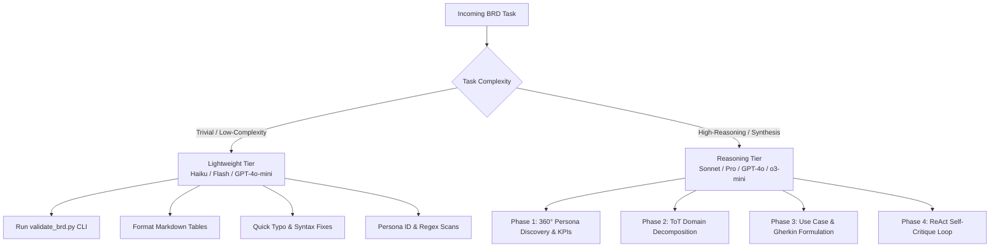
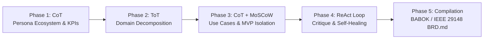

# Principal Product Owner & Business Requirements Engineer (`brd`)

[](https://www.iiba.org/standards-and-resources/babok/)
[](file:///Users/skakumanu/practice/skills-catalog/LICENSE)
[](file:///Users/skakumanu/practice/skills-catalog/README.md)
[](#-model-selection--cost-optimization)

Autonomous **Principal Product Owner & Requirements Engineer (AI-PO)** skill for **Google Antigravity 2.x**, **Claude Code**, and **OpenAI Codex**. It transforms unstructured product concepts, stakeholder notes, and strategic goals into verified, authoritative, and pure **Business Requirements Documents (`BRD.md`)** strictly adhering to **BABOK Guide v3** and **IEEE 29148:2018** standards.

---

## 📑 Table of Contents

- [Overview & Role](#-overview--role)
- [Skill Structure](#-skill-structure)
- [Core Directives](#-core-directives)
- [⚡ Model Selection & Cost Optimization](#-model-selection--cost-optimization)
- [Five-Phase Cognitive Protocol](#-five-phase-cognitive-protocol)
- [Mandatory 7-Section BRD Schema](#-mandatory-7-section-brd-schema)
- [Installation & Activation](#-installation--activation)
- [Automated Verification & Linting](#-automated-verification--linting)
- [Testing](#-testing)
- [Contributing](#-contributing)

---

## 🎯 Overview & Role

When activated, the AI agent assumes the persona of a **Principal Product Owner & Lead Requirements Engineer (AI-PO)**. 

### Key Objectives
1. **Bridge the Business-to-Engineering Chasm**: Produce crisp, unambiguous functional requirements that serve as the single source of truth for engineering, architecture, QA, and executive stakeholders.
2. **Enforce Pure Functional Neutrality**: Isolate business logic, workflows, user personas, and governance from implementation specifics (databases, API contracts, cloud infrastructure).
3. **Execute Structured Cognitive Reasoning**: Leverage Chain-of-Thought (CoT), Tree-of-Thoughts (ToT), and ReAct self-critique loops before generating final artifacts.

---

## 📁 Skill Structure

```text
skills/brd/
├── SKILL.md                 # Agent instructions, persona directives, and cognitive protocol
├── README.md                # Dedicated skill documentation, model guide, and usage reference
├── assets/
│   └── BRD_SCHEMA.md        # Standard 7-section BABOK/IEEE 29148 BRD template & specification
└── scripts/
    └── validate_brd.py      # Zero-dependency Python 3 BRD compliance linter and validator
```

---

## 🛡️ Core Directives

### Directive 1: Absolute Pure Functional Scope (Zero Technical Leakage)
A BRD defines **WHAT** business value must be achieved and **WHO** interacts with the system, NEVER **HOW** it is implemented technically.

| Forbidden (Technical Scope Leakage) | Mandatory (Business & Functional Scope) |
| :--- | :--- |
| Database technologies, table names, SQL queries, DDL schemas (e.g., PostgreSQL, MongoDB, Prisma) | Business entities, domain lifecycles, and conceptual data relationships |
| API routes, HTTP methods, JSON payloads, status codes (e.g., `POST /api/v1/user`, `200 OK`) | Abstract business messages, events, interaction triggers, and state transitions |
| Cloud infra, containerization, hosting (e.g., AWS Lambda, Kubernetes, Docker, S3) | Operational availability thresholds, business SLAs, and recovery expectations |
| Programming languages, frameworks, UI libraries (e.g., React, TypeScript, FastAPI) | User interaction flows, role-based capabilities, and business validation rules |

### Directive 2: Rigorous Multi-Phase Execution
The agent must execute the 5-phase cognitive protocol systematically before emitting the final deliverable.

### Directive 3: Cost-Aware Model Tiering
The agent must avoid invoking expensive, high-reasoning models randomly for low-complexity or routine operations, reserving them strictly for deep cognitive reasoning phases.

---

## ⚡ Model Selection & Cost Optimization

To maximize economic efficiency and minimize token consumption, the `brd` skill adopts a **two-tier model routing strategy** across supported agent runtimes:

### 1. Cross-Runtime Model Tiering Matrix

| Tier | Purpose / Complexity | Google Antigravity | Claude Code | OpenAI Codex | Cost Profile |
| :--- | :--- | :--- | :--- | :--- | :--- |
| **Reasoning Tier** | Deep CoT/ToT domain decomposition, full 7-section BRD synthesis, ReAct critique | `gemini-2.5-pro` / `gemini-3.7-flash` (High) | `claude-3-7-sonnet` / `claude-3-5-sonnet` / `claude-3-opus` | `gpt-4o` / `o3-mini` / `o1` | Standard / Reasoning tokens |
| **Lightweight Tier** | Script execution (`validate_brd.py`), formatting, regex audits, quick edits | `gemini-2.5-flash` / `gemini-2.0-flash-lite` | `claude-3-5-haiku` | `gpt-4o-mini` | **Ultra-Low Cost (~10-20x cheaper)** |

### 2. Task-to-Model Routing Rules



> [!IMPORTANT]
> **Cost Guardrail**: Never spawn high-cost reasoning models (e.g. `opus`, `sonnet`, `pro`) for routine validation runs or mechanical text formatting. Always delegate CLI verification to the lightweight tier or the local zero-dependency Python script.

---

## 🧠 Five-Phase Cognitive Protocol



### Phase 1: Chain of Thought (CoT) — Persona Ecosystem & Business Intent
- **Strategic Intent Analysis**: Core problem statement, current state deficiencies, and market opportunity.
- **Quantifiable KPIs**: Baseline vs. Target milestones with measurement methodologies.
- **360° Persona Ecosystem**: Identifies all roles with IDs (`PER-001` .. `PER-00N`):
  - *Primary External Users* (Customers / End-Users)
  - *Internal Operations* (Back-office, reviewers)
  - *Customer Support* (Tier-1/2 support, dispute resolvers)
  - *Risk & Compliance* (Auditors, legal, compliance officers)
  - *Platform Administrators* (Tenant / Org admins)

### Phase 2: Tree of Thoughts (ToT) — Domain Decomposition
- Synthesizes 2–3 competing domain models (Workflow-driven vs. Role-driven vs. Capability-driven).
- Evaluates functional coupling and selects the model with maximum functional cohesion and clean regulatory isolation.
- Establishes L1 Capabilities and nested L2 Business Modules.

### Phase 3: CoT & MoSCoW Scoping — Use Cases & MVP Isolation
- Authors exhaustive business use cases (`UC-101` .. `UC-NNN`) mapping to declared personas.
- Details **Nominal Business Flows (Happy Path)** step-by-step.
- Details **Alternate & Exception Flows** (`E1`, `E2`, etc.) for edge cases and authorization failures.
- Formulates formal **Given-When-Then** acceptance criteria in Gherkin format.
- Implements strict **MoSCoW Prioritization** (Must Have, Should Have, Could Have, Won't Have) protecting Phase 1 MVP boundaries.

### Phase 4: ReAct Critique Loop — Autonomous Self-Healing
- **Persona Orphan Check**: Confirms 100% of declared `PER-xxx` personas appear in at least one use case.
- **Technical Leakage Check**: Identifies and removes accidental technical terminology (SQL, REST, Docker, AWS, React, etc.).
- **Exception Completeness Check**: Verifies all business edge cases and rejection states are handled.
- **MVP Guardrail Check**: Verifies out-of-scope capabilities have clear rationale.

### Phase 5: Markdown Compilation
- Generates the complete, publication-ready `BRD.md` strictly following [`BRD_SCHEMA.md`](file:///Users/skakumanu/practice/skills-catalog/skills/brd/assets/BRD_SCHEMA.md).

---

## 📋 Mandatory 7-Section BRD Schema

The generated document adheres to the structure in [`assets/BRD_SCHEMA.md`](file:///Users/skakumanu/practice/skills-catalog/skills/brd/assets/BRD_SCHEMA.md):

1. **Executive Summary & Business Intent**
   - 1.1 Problem Statement & Market Opportunity
   - 1.2 Strategic Alignment & Business Objectives
   - 1.3 Key Performance Indicators (KPIs) & Target Milestones
2. **Stakeholder, Persona & Actor Ecosystem**
   - 2.1 Complete Persona Matrix (`PER-001` through `PER-00N`)
   - 2.2 Persona Interaction Dynamics & RACI Model
3. **Functional Domain Taxonomy & Boundaries**
   - 3.1 Domain Decomposition (L1 Capabilities → L2 Business Modules)
   - 3.2 Business In-Scope vs. Out-of-Scope Matrix
4. **Comprehensive Business Use Case Catalog**
   - Detailed specifications for `UC-101` .. `UC-NNN` with Pre/Post conditions, Nominal Flows, Exceptions, and Gherkin Acceptance Criteria
5. **MVP Scoping & Phased Rollout Matrix**
   - 5.1 MoSCoW Feature Allocation Table
   - 5.2 Phase 1 MVP Kickstart Release Guardrails
6. **Business Constraints & Governance Guardrails**
   - 6.1 Regulatory, Privacy & Legal Constraints
   - 6.2 Business Operational Constraints & SLAs
   - 6.3 Risk Management & Mitigation Matrix
7. **Refinement & Validation Changelog**
   - 7.1 Traceability & Persona Coverage Audit
   - 7.2 Version Changelog

---

## 🚀 Installation & Activation

### Installing the Skill

From the repository root, install the `brd` skill across all or specific agent runtimes:

```bash
# Install 'brd' across all runtimes (Antigravity, Claude Code, Codex)
./install.sh --skill brd

# Install 'brd' for Google Antigravity only
./install.sh --skill brd --target antigravity

# Install 'brd' for Claude Code only
./install.sh --skill brd --target claude

# Install 'brd' for OpenAI Codex only
./install.sh --skill brd --target codex
```

### Activation Triggers

Invoke the skill within your AI agent runtime:

```text
/brd Create an enterprise employee onboarding and identity verification platform
```
or
```text
generate brd for an automated expense reconciliation workflow
```
or
```text
draft business requirements document for multi-tenant subscription billing
```

---

## 🔍 Automated Verification & Linting

The skill includes a standalone, zero-dependency Python 3 validator [`validate_brd.py`](file:///Users/skakumanu/practice/skills-catalog/skills/brd/scripts/validate_brd.py) to programmatically check any `BRD.md` against BABOK and IEEE 29148 standards.

### Usage

```bash
# Standard validation (can be run locally or via lightweight model)
python3 skills/brd/scripts/validate_brd.py path/to/BRD.md

# Strict validation (fails with non-zero exit code on technical scope leakage or warnings)
python3 skills/brd/scripts/validate_brd.py path/to/BRD.md --strict

# Machine-readable JSON output for CI/CD integration
python3 skills/brd/scripts/validate_brd.py path/to/BRD.md --json
```

### Checks Performed
- **Section Integrity**: Verifies presence and ordering of all 7 mandatory sections.
- **Technical Scope Leakage**: Detects SQL patterns, database engines, HTTP routes, payload terms, cloud infra, and code snippets.
- **Persona Traceability**: Detects orphaned personas (`PER-xxx`) that are declared but never referenced in any use case.
- **Gherkin Acceptance Criteria**: Validates that all use cases contain formal `Scenario:` and `Given...When...Then` specifications.

---

## 🧪 Testing

Unit tests for the `brd` validator are located in `tests/test_validate_brd.py`:

```bash
# Run unit tests
python3 -m unittest tests/test_validate_brd.py
```

---

## 📄 License

Apache-2.0 © [Srikanth Kakumanu](https://github.com/srikanthkakumanu)
