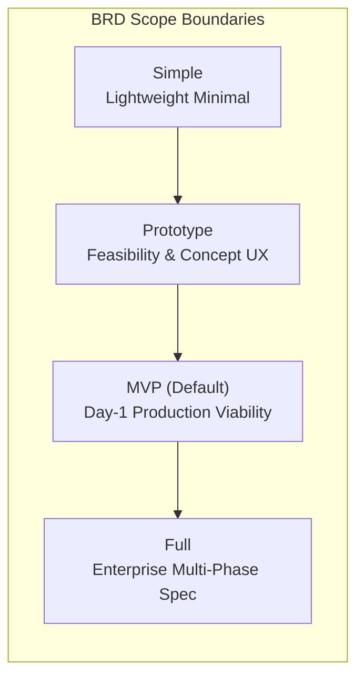
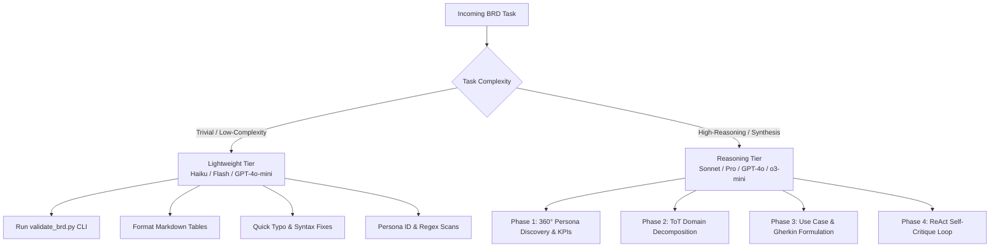
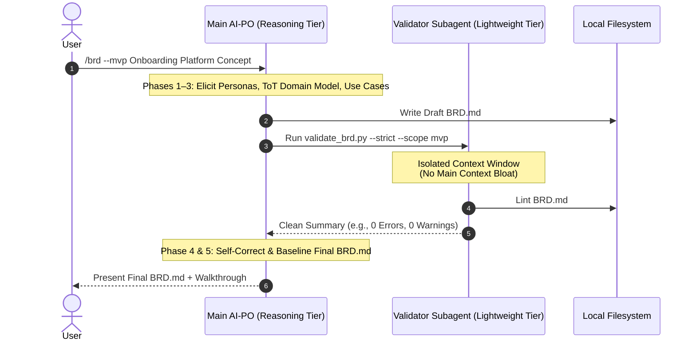

# Principal Product Owner & Business Requirements Engineer (`brd`)

[](https://www.iiba.org/standards-and-resources/babok/)
[](file:///Users/skakumanu/practice/skills-catalog/LICENSE)
[](file:///Users/skakumanu/practice/skills-catalog/README.md)
[](#-scope-boundaries-simple-prototype-mvp-full)
[](#-model-selection--cost-optimization)
[](#-context-window-management--token-efficiency)

Autonomous **Principal Product Owner & Requirements Engineer (AI-PO)** skill for **Google Antigravity 2.x**, **Claude Code**, and **OpenAI Codex**. It transforms unstructured product concepts, stakeholder notes, and strategic goals into verified, authoritative, and pure **Business Requirements Documents (`BRD.md`)** tailored to your desired delivery boundary (**`simple`**, **`prototype`**, **`mvp`**, or **`full`**) while strictly adhering to **BABOK Guide v3** and **IEEE 29148:2018** standards.

---

## 📑 Table of Contents

- [Overview &amp; Role](#-overview--role)
- [Skill Structure](#-skill-structure)
- [Core Directives](#-core-directives)
- [🎯 Scope Boundaries: Simple, Prototype, MVP, Full](#-scope-boundaries-simple-prototype-mvp-full)
- [⚡ Model Selection &amp; Cost Optimization](#-model-selection--cost-optimization)
- [🧠 Context Window Management &amp; Token Efficiency](#-context-window-management--token-efficiency)
- [Five-Phase Cognitive Protocol](#-five-phase-cognitive-protocol)
- [Mandatory 7-Section BRD Schema](#-mandatory-7-section-brd-schema)
- [Installation &amp; Activation](#-installation--activation)
- [Automated Verification &amp; Linting](#-automated-verification--linting)
- [Testing](#-testing)
- [Contributing](#-contributing)

---

## 🎯 Overview & Role

When activated, the AI agent assumes the persona of a **Principal Product Owner & Lead Requirements Engineer (AI-PO)**.

### Key Objectives

1. **Calibrate Output to Delivery Target**: Understands and strictly bounds requirements according to your selected scope: **`simple`**, **`prototype`**, **`mvp`**, or **`full`**.
2. **Bridge the Business-to-Engineering Chasm**: Produce crisp, unambiguous functional requirements that serve as the single source of truth for engineering, architecture, QA, and executive stakeholders.
3. **Enforce Pure Functional Neutrality**: Isolate business logic, workflows, user personas, and governance from implementation specifics (databases, API contracts, cloud infrastructure).
4. **Execute Structured Cognitive Reasoning**: Leverage Chain-of-Thought (CoT), Tree-of-Thoughts (ToT), and ReAct self-critique loops before generating final artifacts.

---

## 📁 Skill Structure

```text
skills/brd/
├── SKILL.md                 # Agent instructions, persona directives, and cognitive protocol
├── README.md                # Dedicated skill documentation, model guide, and context specs
├── assets/
│   ├── BRD_SCHEMA.md        # Standard 7-section BABOK/IEEE 29148 BRD template & specification
│   └── BRD_SCHEMA_SIMPLE.md # Lightweight 4-section simple scope BRD template
└── scripts/
    └── validate_brd.py      # Zero-dependency Python 3 BRD compliance linter and validator
```

---

## 🛡️ Core Directives

### Directive 1: Absolute Pure Functional Scope (Zero Technical Leakage)

A BRD defines **WHAT** business value must be achieved and **WHO** interacts with the system, NEVER **HOW** it is implemented technically.

| Forbidden (Technical Scope Leakage)                                                              | Mandatory (Business & Functional Scope)                                         |
| :----------------------------------------------------------------------------------------------- | :------------------------------------------------------------------------------ |
| Database technologies, table names, SQL queries, DDL schemas (e.g., PostgreSQL, MongoDB, Prisma) | Business entities, domain lifecycles, and conceptual data relationships         |
| API routes, HTTP methods, JSON payloads, status codes (e.g.,`POST /api/v1/user`, `200 OK`)   | Abstract business messages, events, interaction triggers, and state transitions |
| Cloud infra, containerization, hosting (e.g., AWS Lambda, Kubernetes, Docker, S3)                | Operational availability thresholds, business SLAs, and recovery expectations   |
| Programming languages, frameworks, UI libraries (e.g., React, TypeScript, FastAPI)               | User interaction flows, role-based capabilities, and business validation rules  |

### Directive 2: Rigorous Multi-Phase Execution

The agent must execute the 5-phase cognitive protocol systematically before emitting the final deliverable.

### Directive 3: Cost-Aware Model Tiering

The agent must avoid invoking expensive, high-reasoning models randomly for low-complexity or routine operations, reserving them strictly for deep cognitive reasoning phases.

### Directive 4: Context Window Optimization & Progressive Loading

The agent must keep the active context window clean and unburdened by applying progressive loading, subagent delegation, and line-sliced file operations.

### Directive 5: Strict Scope Boundary Control (`simple` | `prototype` | `mvp` | `full`)

The agent must strictly calibrate the depth, personas, use cases, and governance constraints to the selected scope boundary.

---

## 🎯 Scope Boundaries: Simple, Prototype, MVP, Full

The `brd` skill natively understands four delivery targets and tailors its cognitive reasoning and documentation depth accordingly:



### Scope Comparison Matrix

| Feature Dimension                  | 📋 Simple Scope                                                                       | 🧪 Prototype Scope                                                             | 🚀 MVP Scope (Default)                                                                   | 🏢 Full Enterprise Scope                                                                     |
| :--------------------------------- | :------------------------------------------------------------------------------------ | :----------------------------------------------------------------------------- | :--------------------------------------------------------------------------------------- | :------------------------------------------------------------------------------------------- |
| **Primary Objective**        | Rapid, throwaway requirements for quick validation                                    | Validate concept feasibility, key assumptions, and core user journey           | Deliver leanest standalone viable release delivering real business value                 | Comprehensive multi-tenant platform with long-term roadmap                                   |
| **Stakeholder Ecosystem**    | 1–2 essential roles (minimal detail)                                                 | 1–2 essential actors (`PER-001` End User, `PER-002` basic Admin/Reviewer) | 3–4 core operational actors (End-User, Ops Specialist, Admin/Support)                   | Full 360° ecosystem (5+ actors including Risk, Compliance, Tier-1/2 Support, Tenant Admins) |
| **Domain Decomposition**     | Lightweight tree (Domains → Modules → Submodules, no L1/L2 formality)               | 1 focused core capability flow                                                 | 2–3 core L1 capabilities isolating the MVP module cut-line                              | Exhaustive hierarchy of all L1 capabilities and nested L2 business modules                   |
| **Use Case Structure**       | 1–2 flows with Workflow, Happy Path, Exception Paths, Gherkin                        | 1–2 happy path nominal flows (`UC-101`, `UC-102`) + basic input errors    | Full nominal flows + primary exception flows (`E1`, `E2`) + Given-When-Then criteria | Complete use case catalog covering all nominal, alternate, edge, and disaster recovery flows |
| **Prioritization & Roadmap** | Mapping Matrix only (no MoSCoW)                                                       | 100% focused on Prototype validation slice                                     | Strict Must-Haves (Phase 1) vs Should/Could Haves (Phase 2+)                             | Multi-phased release roadmap (Phase 1 MVP, Phase 2 Scaling, Phase 3 Enterprise, Horizon)     |
| **Governance & Constraints** | N/A — excluded by design                                                             | Lightweight assumptions; DR and heavy regulatory compliance deferred           | Core privacy/legal constraints and Day-1 operational SLAs                                | Comprehensive regulatory matrices (GDPR, HIPAA, SOC2), enterprise SLAs (99.9x%, RTO/RPO)     |
| **Section Count & Schema**   | 4-section lightweight (Domain & Module Taxonomy, Personas, Use Cases, Mapping Matrix) | 7-section BABOK/IEEE (full structure)                                          | 7-section BABOK/IEEE (full structure)                                                    | 7-section BABOK/IEEE (full structure)                                                        |
| **Metadata Header**          | `**Scope Level** \| `Simple``                                                        | `**Scope Level** \| `Prototype``                                              | `**Scope Level** \| `MVP``                                                              | `**Scope Level** \| `Full``                                                                 |

---

## ⚡ Model Selection & Cost Optimization

To maximize economic efficiency and minimize token consumption, the `brd` skill adopts a **two-tier model routing strategy** across supported agent runtimes:

### 1. Cross-Runtime Model Tiering Matrix

| Tier                       | Purpose / Complexity                                                            | Google Antigravity                               | Claude Code                                                       | OpenAI Codex                      | Cost Profile                               |
| :------------------------- | :------------------------------------------------------------------------------ | :----------------------------------------------- | :---------------------------------------------------------------- | :-------------------------------- | :----------------------------------------- |
| **Reasoning Tier**   | Deep CoT/ToT domain decomposition, full 7-section BRD synthesis, ReAct critique | `gemini-2.5-pro` / `gemini-3.7-flash` (High) | `claude-3-7-sonnet` / `claude-3-5-sonnet` / `claude-3-opus` | `gpt-4o` / `o3-mini` / `o1` | Standard / Reasoning tokens                |
| **Lightweight Tier** | Script execution (`validate_brd.py`), formatting, regex audits, quick edits   | `gemini-2.5-flash` / `gemini-2.0-flash-lite` | `claude-3-5-haiku`                                              | `gpt-4o-mini`                   | **Ultra-Low Cost (~10-20x cheaper)** |

### 2. Task-to-Model Routing Rules



> [!IMPORTANT]
> **Cost Guardrail**: Never spawn high-cost reasoning models (e.g. `opus`, `sonnet`, `pro`) for routine validation runs or mechanical text formatting. Always delegate CLI verification to the lightweight tier or the local zero-dependency Python script.

---

## 🧠 Context Window Management & Token Efficiency

Generating enterprise-grade Business Requirements Documents requires processing hundreds of requirements and personas. Without deliberate context management, token saturation degrades reasoning accuracy. The `brd` skill enforces four context preservation strategies:

### 1. Progressive Asset Loading (Lazy Loading)

- The `brd` skill instructions in `SKILL.md` are compact (~1.5k tokens). Supporting assets (`BRD_SCHEMA.md`, validator scripts) are read **just-in-time** only when entering Phase 5 (Compilation).

### 2. Subagent Context Isolation

- The orchestrator spawns an ephemeral **Lightweight Subagent** (or runs `validate_brd.py --json` locally), which performs the audit in an isolated context window and returns only a compact diagnostic summary.



### 3. Line-Bounded Slicing for Document Edits

- Use `view_file` with precise `StartLine` and `EndLine` parameters.
- Use targeted chunk replacements (`replace_file_content`) to update specific sections without reloading the entire document.

### 4. Compact CLI Output Modes

- The bundled validator [`validate_brd.py`](file:///Users/skakumanu/practice/skills-catalog/skills/brd/scripts/validate_brd.py) supports `--quiet` and `--json` flags to emit concise machine-readable status reports rather than voluminous stack dumps.

---

## 🔬 Five-Phase Cognitive Protocol


### Phase 1: Chain of Thought (CoT) — Persona Ecosystem & Business Intent

- **Strategic Intent Analysis**: Problem statement and market opportunity.
- **Quantifiable KPIs**: Calibrated baseline vs. target milestones based on scope (simple scope skips KPIs).
- **Persona Ecosystem**: Tailored persona count (1–2 for Simple/Prototype, 3–4 for MVP, 5+ for Full).

### Phase 2: Tree of Thoughts (ToT) — Domain Decomposition

- Synthesizes 2–3 competing domain models (Workflow vs Role vs Capability), or simplified for simple scope.
- Selects the path with maximum cohesion and isolates scope boundaries.
- Establishes L1 Capabilities and L2 Business Modules (or lightweight Domain & Module tree for simple scope).

### Phase 3: CoT & MoSCoW Scoping — Use Cases & MVP Isolation

- Authors use cases (`UC-101` .. `UC-NNN`) mapped to declared personas.
- Details Nominal flows, Alternate/Exception flows, and Gherkin acceptance criteria.
- Implements scope-specific MoSCoW feature allocation (or Mapping Matrix for simple scope).

### Phase 4: ReAct Critique Loop — Autonomous Self-Healing

- **Persona Orphan Check**: Confirms 100% of declared `PER-xxx` personas appear in use cases.
- **Technical Leakage Check**: Identifies and removes accidental technical terminology.
- **Scope Boundary Check**: Confirms requirements do not bleed across scope limits.
- **Exception Completeness Check**: Verifies all business edge cases are accounted for.

### Phase 5: Markdown Compilation

- Emits publication-ready `BRD.md` with explicit `Scope Level` header attribute.

---

## 📋 Mandatory 7-Section BRD Schema

The generated document adheres to the structure in [`assets/BRD_SCHEMA.md`](file:///Users/skakumanu/practice/skills-catalog/skills/brd/assets/BRD_SCHEMA.md):

1. **Executive Summary & Business Intent**
   - 1.1 Problem Statement & Market Opportunity
   - 1.2 Strategic Alignment & Business Objectives
   - 1.3 Key Performance Indicators (KPIs) & Target Milestones
2. **Stakeholder, Persona & Actor Ecosystem**
   - 2.1 Complete Persona Matrix (`PER-001` through `PER-00N`)
   - 2.2 Persona Interaction Dynamics & RACI Model
3. **Functional Domain Taxonomy & Boundaries**
   - 3.1 Domain Decomposition (L1 Capabilities → L2 Business Modules)
   - 3.2 Business In-Scope vs. Out-of-Scope Matrix
4. **Comprehensive Business Use Case Catalog**
   - Detailed specifications for `UC-101` .. `UC-NNN` with Pre/Post conditions, Nominal Flows, Exceptions, and Gherkin Acceptance Criteria
5. **MVP Scoping & Phased Rollout Matrix**
   - 5.1 MoSCoW Feature Allocation Table
   - 5.2 Phase 1 MVP Kickstart Release Guardrails
6. **Business Constraints & Governance Guardrails**
   - 6.1 Regulatory, Privacy & Legal Constraints
   - 6.2 Business Operational Constraints & SLAs
   - 6.3 Risk Management & Mitigation Matrix
7. **Refinement & Validation Changelog**
   - 7.1 Traceability & Persona Coverage Audit
   - 7.2 Version Changelog

---

## 🚀 Installation & Activation

### Installing the Skill

```bash
# Install 'brd' across all runtimes (Antigravity, Claude Code, Codex)
./install.sh --skill brd

# Targeted runtime installations
./install.sh --skill brd --target antigravity
./install.sh --skill brd --target claude
./install.sh --skill brd --target codex
```

### Activation Triggers by Scope

Invoke the skill within your AI agent runtime with your desired scope boundary:

#### 1. Simple Scope Invocation

```text
/brd --scope simple Quick workflow for internal team expense tracking
```

or

```text
generate simple brd for employee feedback collection
```

#### 2. Prototype Scope Invocation

```text
/brd --scope prototype Create a quick interactive prototype for expense receipt snapping
```

or

```text
generate prototype brd for customer onboarding flow
```

#### 3. MVP Scope Invocation (Default)

```text
/brd --scope mvp Create a production MVP for automated expense reconciliation
```

or

```text
/brd Create an automated expense reconciliation workflow
```

#### 4. Full Enterprise Scope Invocation

```text
/brd --scope full Create a complete enterprise billing and multi-tenant subscription platform
```

or

```text
generate full enterprise brd for multi-tenant subscription billing
```

---

## 🔍 Automated Verification & Linting

Validate any generated `BRD.md` against BABOK, IEEE 29148, and Scope Boundaries using [`validate_brd.py`](file:///Users/skakumanu/practice/skills-catalog/skills/brd/scripts/validate_brd.py):

### Usage

```bash
# Standard validation (auto-detects scope from document metadata)
python3 skills/brd/scripts/validate_brd.py path/to/BRD.md

# Strict validation with explicit scope enforcement
python3 skills/brd/scripts/validate_brd.py path/to/BRD.md --strict --scope prototype
python3 skills/brd/scripts/validate_brd.py path/to/BRD.md --strict --scope mvp
python3 skills/brd/scripts/validate_brd.py path/to/BRD.md --strict --scope full

# Machine-readable JSON output for CI/CD integration
python3 skills/brd/scripts/validate_brd.py path/to/BRD.md --json
```

---

## 🧪 Testing

Unit tests for the `brd` validator and catalog registry are located in `tests/`:

```bash
# Run all unit tests
python3 -m unittest discover tests

# Run specific BRD validator test suite
python3 -m unittest tests/test_validate_brd.py
```

---

## 📄 License

Apache-2.0 © [Srikanth Kakumanu](https://github.com/srikanthkakumanu)
